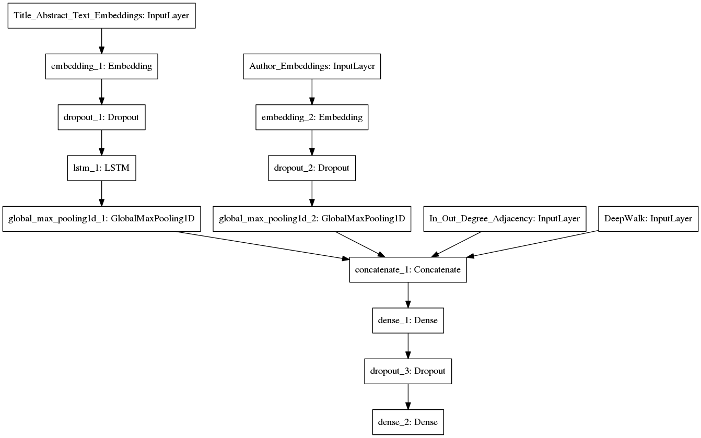
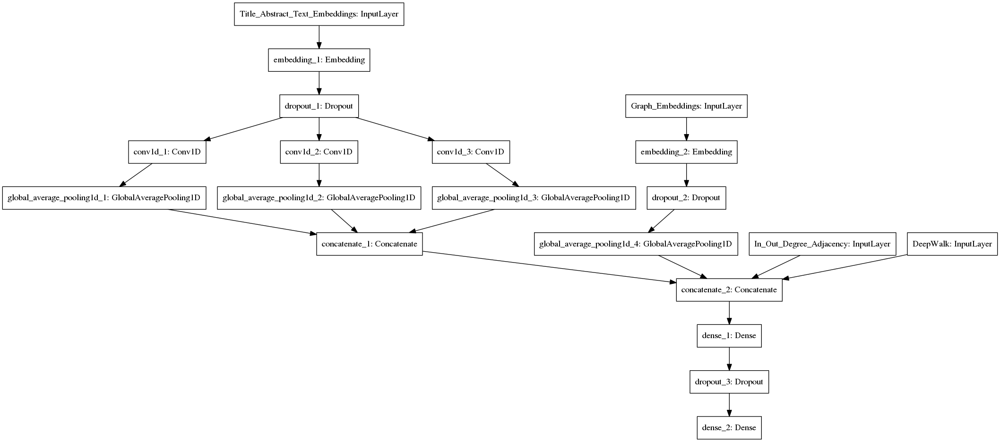

# Kaggle Research Paper Classification Challenge

## Overview

This repository contains the code for my models for a private machine learning Kaggle competition. The competition objective was to create a multilabel classifier that could classify the provided papers on the journal they were published on based on the title, abstract and a graph of citations among the papers.

The competition submissions were evaluated based on the log loss of the predicted vs the actual classes.

My submissions were part of the two person winning team, for which we used a fine tuned ensemble model.

Two different models were created one based on an LSTM neural network that was fed the word embeddings of the combined title and anstract of the paper and a few other features, and a second model based on Convolutional layers with three different filter sizes (3, 7, 11) and again a few more features.

## Installing Requirements

The code requirements are contained in the requirements txt files and can be installed via the pip tool with `pip install -r requirements.txt` or `pip install -r requirements-gpu.txt` for the gpu equiped machines. Please notice you need to also have installed CUDA and cuDNN, and the current version of Keras and Tensorflow are working with CUDA version 8.0 and cuDNN 6.0.

Furthermore the [`DeepWalk`](https://github.com/phanein/deepwalk) library was used to generate the deep-walk features from the Graph, so be also have it installed.

## Models

### LSTM-based

The first model that was build and the one that achieved the best performance on its own, had the following architecture:

We can see that the combined text of the paper title and abstract is passed through the Embedding layer (where the training feature for the words is set to True). This produces the word embeddings which are then passed through a Dropout layer (because training the embeddings tends to produce overfitting), and finally fed into an LSTM. After trying different architectures for the LSTM the one that produced the best result in this problem was for the LSTM to return the result of the word embedding processing at each step and them use a Max Pooling layer to select the max of those as the output.
The second feature that was used is an Embedding representation of the paper authors. All the authors in the papers were transformed into a unique integer and these are fed into an Embedding layer. The layer during training produces vectors that close in space when they are writing on the same journals.
The third feature is a 3-dimensional vector that has the normalized number of incoming/outgoing degrees to each paper, and the average neighbor degree.
The fourth and last feature is a 64-dimensional vector generated as a random walk starting from the current node and continuing to a random neighbor of the node each time. This is based on the [DeepWalk](https://arxiv.org/abs/1403.6652) paper.

### CNN-based

